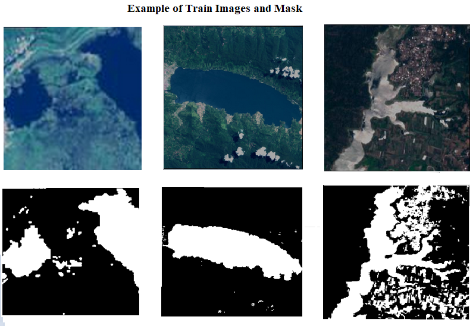
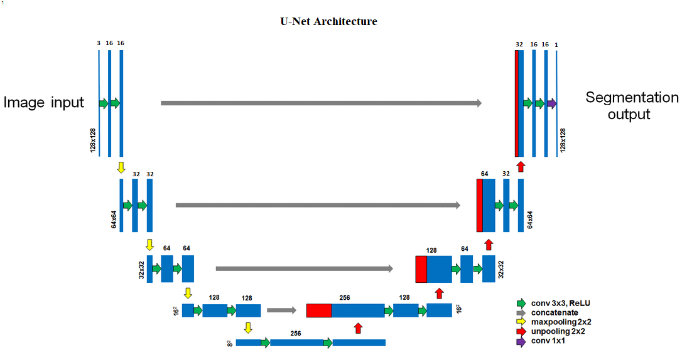
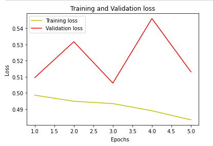
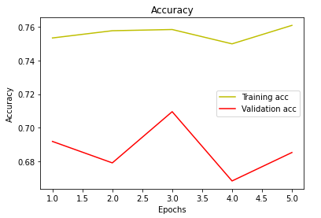
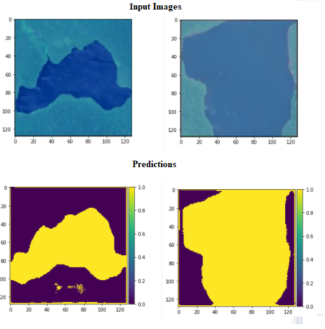

# Water Detection by Semantic Segmentation
Building a detection model using a  U-Net model build from scratch using Tensorflow & Keras. 

**About the data:** 
Here,used geographical images taken by Synthetic Aperture Radar (SAR) satellites.
For SAR C-band data can be freely downloadable from https://scihub.copernicus.eu/
we can also download Sentinel-2 optical data from the second link. An Earth explorer can also be used to download Sentinel data.

The training dataset contains 100 images and corresponding mask-images for each images

## Data Preprocessing

For every image, the following preprocessing steps were applied:

1. Crop the part of the image that contains the water (which is the most important part of the image).
2. Resize the image to have a shape of (128, 128, 3)=(image_width, image_height, number of channels): because images in the dataset come in different sizes. So, all images should have the same shape to feed it as an input to the U-Net neural network.

## Data Split:

The data was split in the following way:
1. 90% of the data for training.
2. 10% of the data for validation.

# Neural Network Architecture

This is the architecture that I've built:

# Training the model
The total epochs applied in this model is 25, best model saved at 3rd epochs with minimum validation loss 0.5061 and these are the loss & accuracy plots:

# Results

In this experiment, the semantic segmentation of water from images are: 

**Performance table of the best model:**

| <!-- -->  |   Train set    |Validation set |
| --------- | -------------- | --------------|
| Accuracy  |     75.84%     |      70.96%   |

Contributes are welcome!
 Thank you!

